# Fuzzy-match audit

Sampled 30 crop(s) where the bootstrap's fuzzy match replaced the raw EasyOCR output with a GT token at Levenshtein distance ≥ 2. For each row, **look at the crop** and decide whether `label_after_correction` is actually what's printed on the crop:

- If **yes** — the fuzzy match was correct (OCR misread a letter, the GT word rescued it). Training on this is fine.
- If **no** — the match hijacked the label to a similar but wrong word. This crop should be dropped (or relabelled). The more of these you see, the more false-positive noise in the training set.

| # | Crop | Raw OCR | Label | Lev | PDF |
|---|------|---------|-------|-----|-----|
| 0 |  | `Экземпляр W` | `экземпляр` | 2 | TN_k_UPD_36_ot_02.09.2022 p0 |
| 1 |  | `нестак` | `местах` | 2 | TN_k_UPD_36_ot_02.09.2022 p0 |
| 2 | 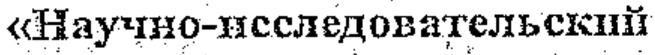 | `{Научно-исследовательскпй` | `научно-исследовательский` | 2 | TN_k_UPD_36_ot_02.09.2022 p2 |
| 3 | 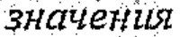 | `значетшя` | `значения` | 2 | TN_k_UPD_36_ot_02.09.2022 p2 |
| 4 |  | `уебование-накладную` | `требование-накладную` | 2 | TN_k_UPD_36_ot_02.09.2022 p2 |
| 5 |  | `рузоотправнтель` | `грузоотправитель` | 2 | TN_k_UPD_41_ot_06.09.2022 p0 |
| 6 |  | `~именование` | `наименование` | 2 | TN_k_UPD_41_ot_06.09.2022 p0 |
| 7 |  | `Тягач с` | `тягач` | 2 | TN_k_UPD_41_ot_06.09.2022 p0 |
| 8 | 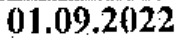 | `01.09.26/22` | `01.09.2022` | 2 | TN_k_UPD_41_ot_06.09.2022 p1 |
| 9 |  | `Отмстки` | `отметка` | 2 | TN_k_UPD_41_ot_06.09.2022 p1 |
| 10 | 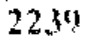 | `22,391` | `2239` | 2 | TN_k_UPD_41_ot_06.09.2022 p2 |
| 11 |  | `Тягач c` | `тягач` | 2 | TN_k_UPD_41_ot_06.09.2022 p2 |
| 12 | 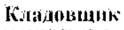 | `Кладовщнк'` | `кладовщик` | 2 | TN_k_UPD_41_ot_06.09.2022 p3 |
| 13 | 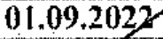 | `01,09,2022` | `01.09.2022` | 2 | TN_k_UPD_41_ot_06.09.2022 p3 |
| 14 |  | `анменование` | `наименование` | 2 | TN_k_UPD_41_ot_06.09.2022 p4 |
| 15 |  | `6 Перевозчик` | `перевозчик` | 2 | TN_k_UPD_41_ot_06.09.2022 p4 |
| 16 |  | `Перевозчика)` | `перевозчик` | 2 | TN_k_UPD_41_ot_06.09.2022 p4 |
| 17 |  | `Тягач c` | `тягач` | 2 | TN_k_UPD_41_ot_06.09.2022 p4 |
| 18 | 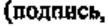 | `(подпнсь` | `подпись` | 2 | TN_k_UPD_41_ot_06.09.2022 p5 |
| 19 | 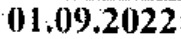 | `(109.2022` | `01.09.2022` | 2 | TN_k_UPD_41_ot_06.09.2022 p6 |
| 20 | 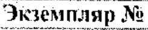 | `Экземпляр N` | `экземпляр` | 2 | TN_k_UPD_41_ot_06.09.2022 p6 |
| 21 | 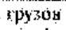 | `трузон` | `грузов` | 2 | TN_k_UPD_41_ot_06.09.2022 p6 |
| 22 | 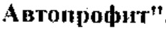 | `Автопрафит"` | `автопрофит` | 2 | TN_k_UPD_41_ot_06.09.2022 p6 |
| 23 |  | `Тягач c` | `тягач` | 2 | TN_k_UPD_41_ot_06.09.2022 p6 |
| 24 | 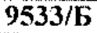 | `95ЗЗ/Б` | `9507/б` | 2 | TN_k_UPD_41_ot_06.09.2022 p8 |
| 25 | 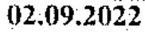 | `(2,09.2022` | `02.09.2022` | 2 | TN_k_UPD_41_ot_06.09.2022 p8 |
| 26 |  | `Тягач c` | `тягач` | 2 | TN_k_UPD_41_ot_06.09.2022 p8 |
| 27 |  | `02,09,2022` | `02.09.2022` | 2 | TN_k_UPD_41_ot_06.09.2022 p9 |
| 28 | 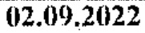 | `(2.09.20/22` | `02.09.2022` | 2 | TN_k_UPD_41_ot_06.09.2022 p9 |
| 29 | 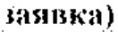 | `зявка)` | `заявка` | 2 | TN_k_UPD_41_ot_06.09.2022 p10 |
