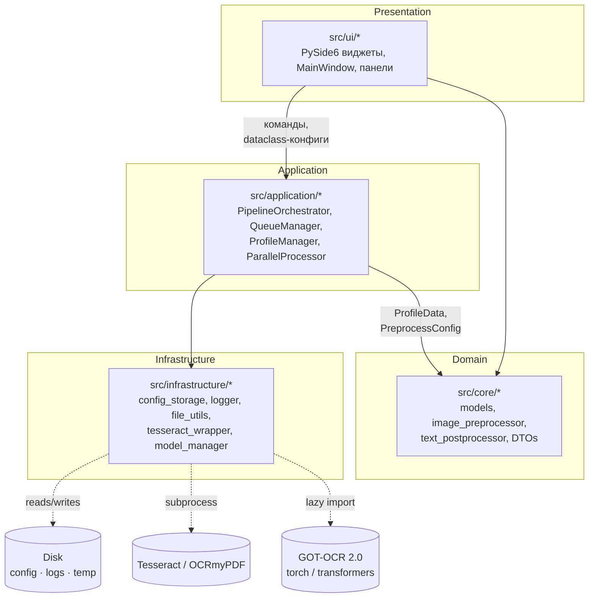
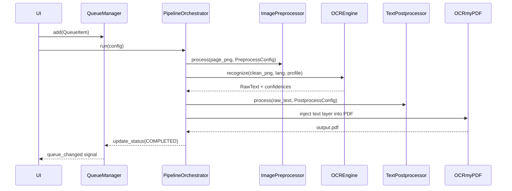

# Архитектура

OCR Studio организован в **четыре концентрических слоя** по принципу
Clean / Hexagonal architecture: зависимости идут только внутрь, ядро
(Domain) не знает ничего о Qt, PyMuPDF или Tesseract.

## Слои

### Presentation (`src/ui/`)

- Все виджеты, диалоги, тулбары, стилистика (`theme.py`).
- Получает состояние через `QueueManager.queue_changed` и
  собственные сигналы панелей (`config_changed`, `retry_requested` …).
- Никогда не импортирует ничего из `infrastructure` напрямую, кроме
  `SettingsStorage` и `ProfileStorage` (они находятся на границе
  слоёв и играют роль репозиториев).

### Application (`src/application/`)

- `PipelineOrchestrator` — оркестратор обработки одного файла.
- `ParallelProcessor` — `ProcessPoolExecutor`, передаёт
  `Manager.Queue` для прогресса.
- `QueueManager` — чисто доменная очередь `QueueItem` с обновлением
  статусов.
- `ProfileManager` — CRUD + `initialize_builtins()`.
- `engines/` — абстракция `OCREngine` (tesseract, got_ocr),
  `registry.py` с `get_engine()`, кешем и `reset_cache()`
  (сбрасывает модель → `engine.unload()`).

### Domain (`src/core/`)

- Pure-Python dataclasses (`ProfileData`, `PreprocessConfig`,
  `PostprocessConfig`, `JobResult`, `PageResult`, …).
- `image_preprocessor.py` — OpenCV + skimage pipeline
  (detect_skew → CLAHE → denoise chain → binarise).
- `text_postprocessor.py` — regex/unicode нормализация с защитой от
  ReDoS (`_substitute_with_timeout`).
- `models.py` — версионирование схемы профилей
  (`PROFILE_SCHEMA_VERSION`) + функция миграции.

### Infrastructure (`src/infrastructure/`)

- `config_storage.py` — JSON-репозитории для профилей и
  `AppSettings`, атомарная запись через `tempfile + os.replace`.
- `logger.py` — `RotatingFileHandler` 5 MB × 5.
- `file_utils.py` — `safe_unique_path`, `suggest_output_path`,
  `cleanup_temp_dir`.
- `tesseract_wrapper.py` — проверка версии, ресолвинг бинарника
  (bundled → PATH).
- `model_manager.py` — скачивание/удаление GOT-OCR-весов с HF-mirror,
  TTL-кэш статуса `is_available`.

## Поток обработки одного файла

## Почему такое разделение

- **Тестируемость.** `core/` и `application/` не зависят от Qt →
  запускаются в `pytest` без `QT_QPA_PLATFORM`.
- **Замена движка.** `OCREngine` — абстрактный класс; добавить
  новый OCR-движок (например, PaddleOCR) — это один файл в
  `application/engines/` + регистрация.
- **Профили — контракт.** Все dataclass'ы в `core/models.py`
  сериализуются в JSON и имеют `from_dict` c версионированием,
  поэтому старые профили читаются новыми версиями приложения.

## Cross-cutting

- **Логирование** — один `logger = logging.getLogger(__name__)` в
  каждом модуле. Главный `setup_logging()` в `infrastructure/logger.py`.
- **Конфигурация путей** — только через `src/shared/constants.py`
  (`CONFIG_DIR`, `LOGS_DIR`, `TEMP_DIR`, …).
- **Перехват исключений UI** — `_install_excepthook()` в `src/app.py`
  пишет `logger.critical` + `QMessageBox.critical` для всего, что
  пролетает мимо слотов.
